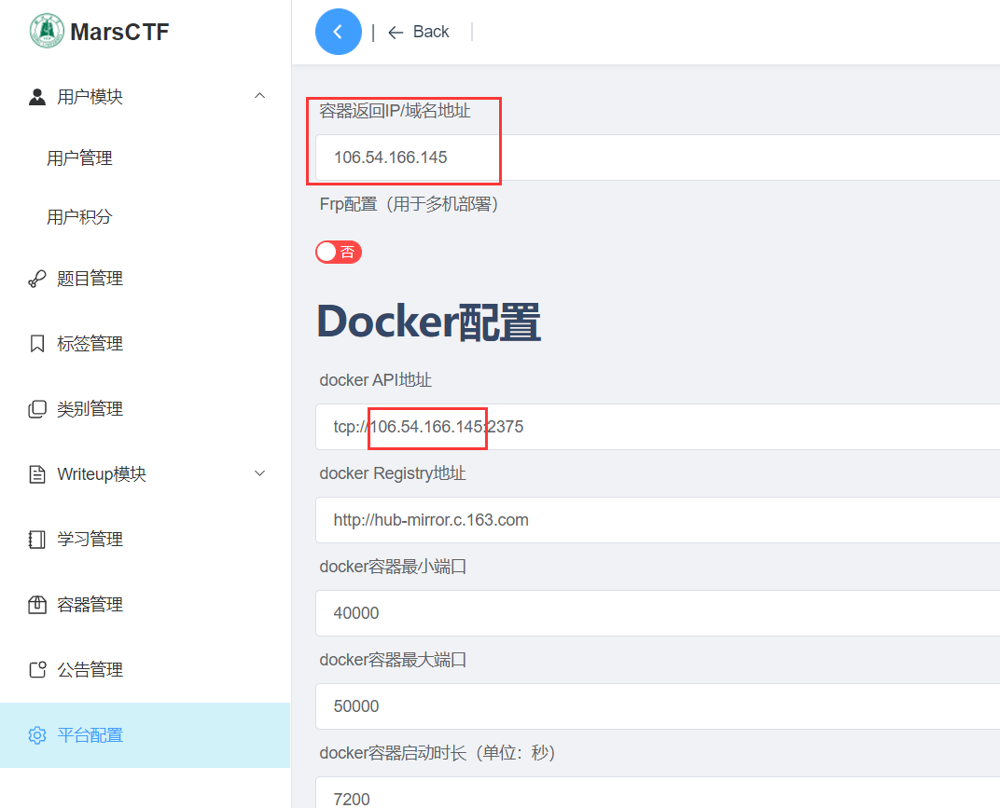
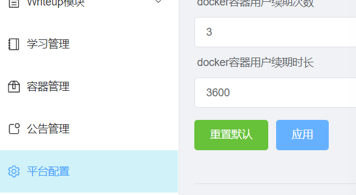

# MarsCTF

Vue+Springboot开发的CTF学习平台，提供动态靶机、学习模块、writeup模块等等CTF平台的核心功能。提供docker版本。


# 快速启动

**初始管理员用户名/密码：admin/123456**

下载 [https://github.com/b1ackc4t/MarsCTF/releases](https://github.com/b1ackc4t/MarsCTF/releases) 里已经打包好的docker包，解压后执行以下命令：

``````bash
chmod -R 755 ./marsctf-docker  # 赋予足够权限
cd ./marsctf-docker
docker-compose up -d
``````

然后访问 **[http://127.0.0.1:7991]()** 即可，使用其他ip无法访问后端服务。

如要修改访问ip，请修改```/marsctf-docker/nginx/html/config.json```的```BASE_URL_PROD```，然后重启服务即可

## 动态靶机支持

### 配置Docker API和TLS密钥

对于**debian系的linux**，已经提供了便携的脚本启动

首先修改```./marsctf-docker/docker-tls/gen_key.sh```里的IP、密码以及其他元数据信息

```
# -------------------------------------------------------------
# 自动创建 Docker TLS 证书
# -------------------------------------------------------------
# 以下是配置信息
# --[BEGIN]------------------------------
IP="192.168.48.202"	# 改为云服务器IP
PASSWORD="b1ackc4tyyds"	# 用于docker-api通信的密钥
# 以下可改可不改
COUNTRY="CN"
STATE="HUBEI"
CITY="WUHAN"
ORGANIZATION="XXSSHH"
ORGANIZATIONAL_UNIT="Dev"
EMAIL="xxxxxxxxx@163.com"
```

改后保存，执行

```bash
cd ./marsctf-docker/docker-tls
chmod +x ./gen_key.sh
chmod +x ./startup.sh
./startup.sh
```

脚本会自动完成开启docker-api、产生tls密钥、配置tls密钥一系列步骤。

---

对于其他linux或者以上脚本失效的情况，则自行配置打开docker api，并配置tls证书，将生成的客户端```ca.pem、ca-key.pem、cert.pem、key.pem```（名称固定，不然识别不到）复制到```./marsctf-docker/main/CertKey```，然后重启docker服务即可

### 系统后台配置相关参数

随后进入系统后台，进行平台docker配置



脚本配置的docker API将红框处修改为自己的IP（云服务器IP）即可，手动配置的docker API就需改为你配置的API地址



点击应用保存设置，至此，动态靶机配置完成。可以愉快使用系统了。

## 手动启动

### 依赖环境

1. mysql8+
2.  jdk8


# 功能预览

1. 学习模块
   * 提供体系化学习资料，并和挑战中的CTF题目相关联
2. 挑战模块
   * 提供CTF题目，支持动态靶机
   * 题目类型、标签均可扩展
3. writeup模块
   * 分享解题思路的平台
4. 公告、排行榜


